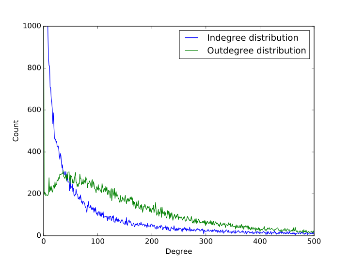
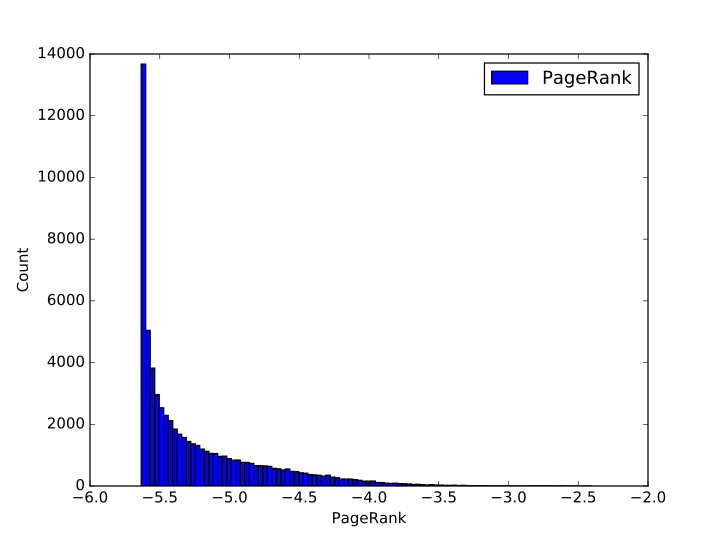
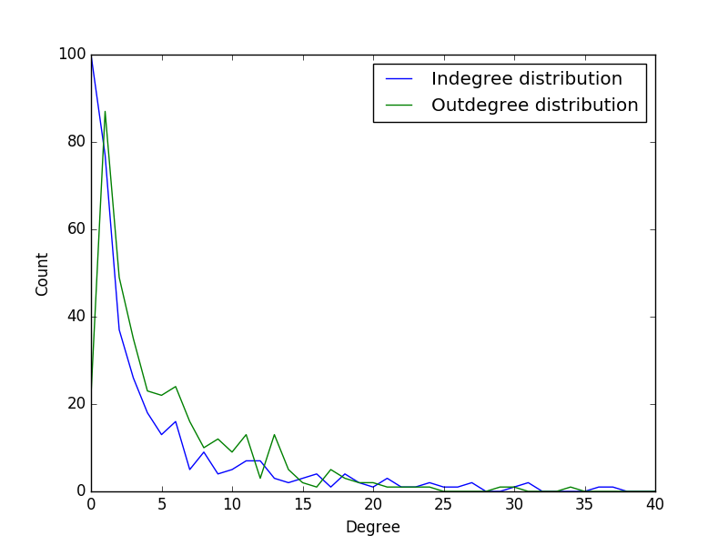
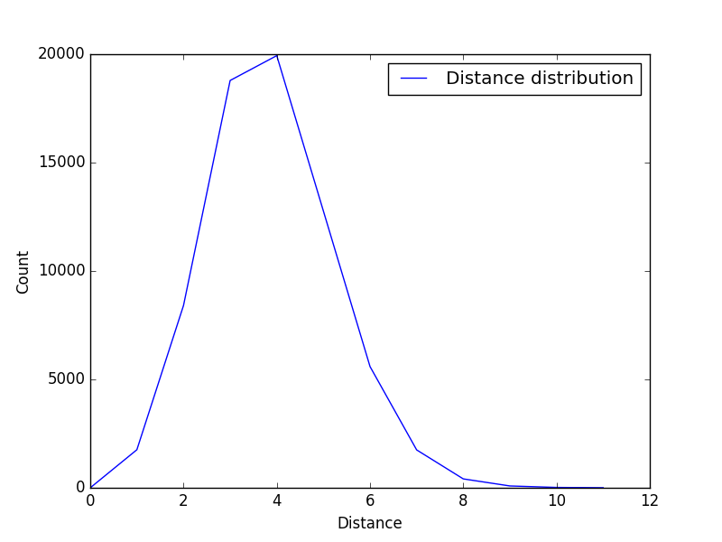
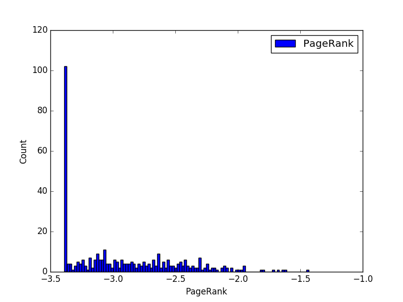
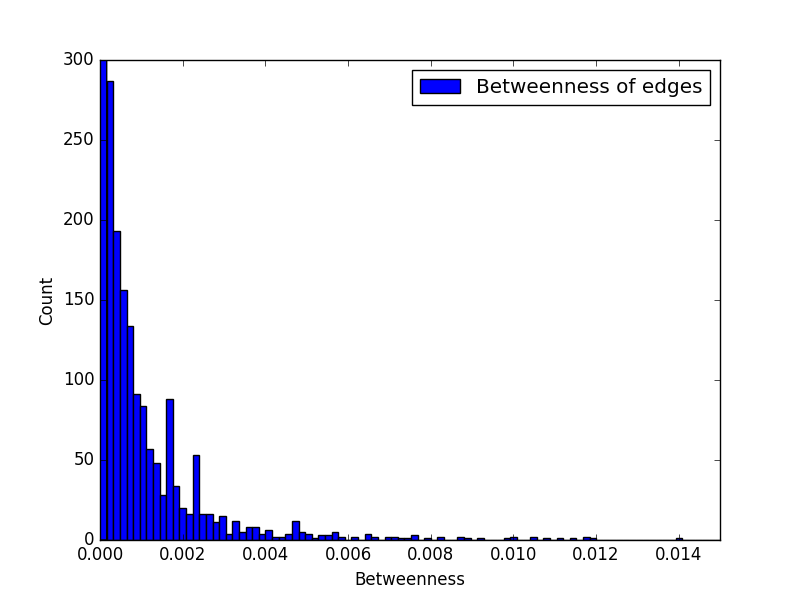
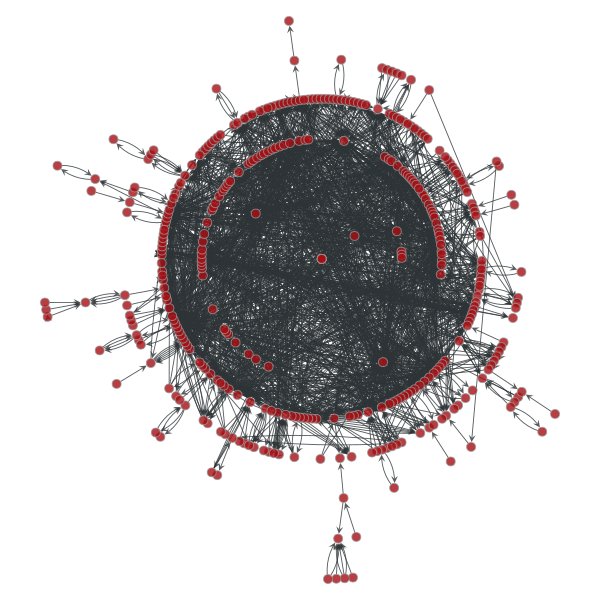
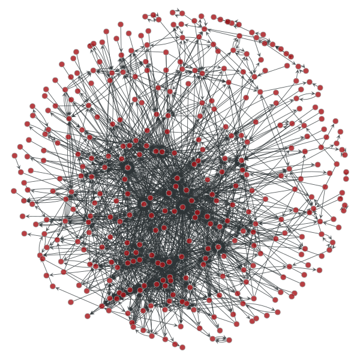
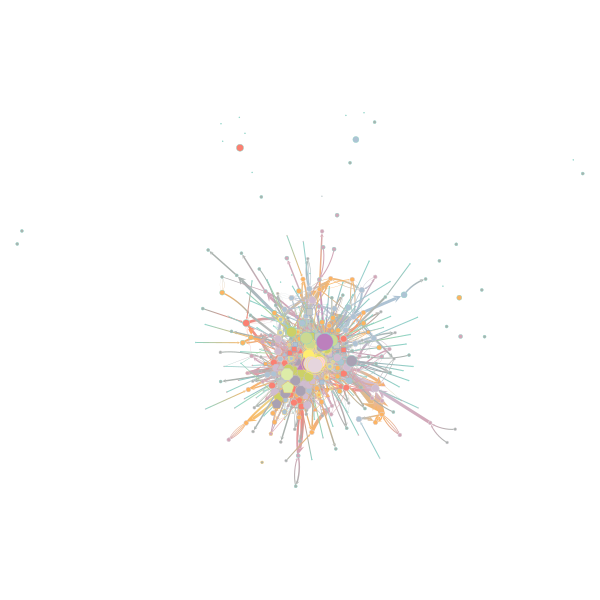
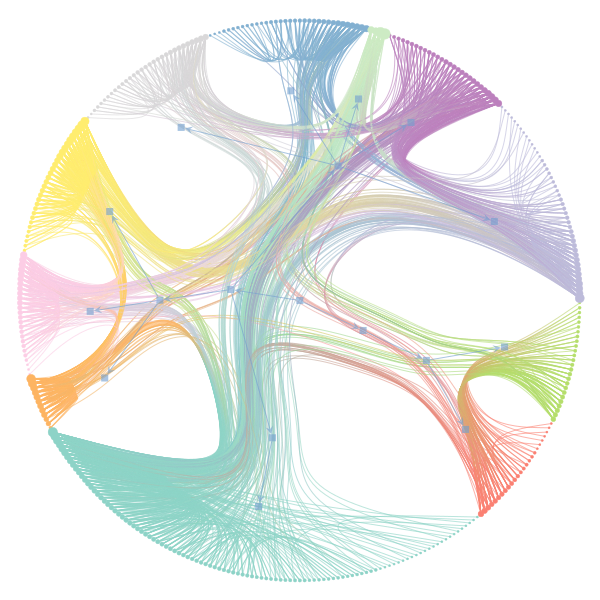

# 微博用户数据分析报告

[](https://www.codacy.com/app/mythsman/Weibo_Data_Analysis?utm_source=github.com&amp;utm_medium=referral&amp;utm_content=mythsman/Weibo_Data_Analysis&amp;utm_campaign=Badge_Grade)
[](https://github.com/mythsman/Weibo_Data_Analysis/blob/master/LICENSE)

## 获得数据
数据为以用户"阿尔卑斯君°"为中心向外bfs搜索得到。

执行src下的gen.sh,在data下生成user.txt,star.txt,relation.txt三个文件。

执行src下的build.py,在data下生成graphAll.xml.gz这个基于graphtools的数据文件。

注意项目中的data文件夹下已经包含了需要下载的数据，数据量还是比较大的，不要轻易git clone .

### user.txt
64452条用户信息，包括：
用户编号，用户编号2(暂时不用)，昵称，性别，个性签名
以制表符分割
例:
```
1000005991	1005051000005991	衷柏夷	他	活在当下,且行且珍惜	福建
1000124571	1005051000124571	工信布	他	互联网科技、经济、生活与宽窄新锐哲思。出版有《互联网时代的浪漫与痛痒——传统行业转型之道》、《嬗变》、《宏声传播集》等。	四川
1000241231	1005051000241231	翡翠羽裳	她	发现近在咫尺的美广东
1000463683	1005051000463683	Ann宝贝琴	她	有一种爱，是信念，从未向时间屈服。	江苏
1000585644	1005051000585644	知心老王	他	心情好，才是真的好！	北京
1000655734	1005051000655734	苏伊finjamie	他		江苏
1000726952	1005051000726952	张毅伟yy	他	上海交通大学EMBA校友会副主席领导力及企业策划专家致力于德鲁克管理的传播	上海
1000830690	1005051000830690	-金浩翔	他		浙江
1000891302	1005051000891302	杨越VJ	他	SMG魅力音乐电视频道总监，VJ，有事电邮yangyue3003@hotmail.com	上海
1001121254	1005051001121254	Rainboy2018	他		北京
```

### star.txt
6339630条点赞关系，包括：
点赞用户编号，被点赞用户编号，点赞时间
以制表符分割，时间格式为YYYY-MM-DD HH:MM:SS
例:
```
1000005991	1065618283	2016-07-12 17:16:47
1000005991	1067942913	2015-09-06 21:35:39
1000005991	1101519144	2014-08-30 23:14:13
1000005991	1180514263	2015-06-11 15:05:19
1000005991	1187900115	2014-06-12 19:14:10
1000005991	1189590121	2015-08-28 23:46:37
1000005991	1191965271	2014-08-17 21:54:44
1000005991	1191965271	2016-02-16 11:13:35
1000005991	1195389671	2015-10-05 16:16:09
1000005991	1198367585	2015-09-23 23:43:51
```

### relatation.txt
34111736条关注关系，包括：
关注者，被关注者
以制表符分割
例:
```
1000005991	1004941280
1000005991	1005592945
1000005991	1007262567
1000005991	1007330514
1000005991	1008927295
1000005991	1008965464
1000005991	1009493500
1000005991	1057805991
1000005991	1062133183
1000005991	1067942913
```

## 数据分析
### 构建原始数据

1. 使用build.py，对user进行去重，对star和relation中含有溢出用户的条目进行过滤。
2. 以user为节点，star和relation为边，构建一个含有重边的连通有向图。

|||
|-|-|
|user vertex|64422|
|star edge|2570280|
|relation edge|9051246|

### 入度出度分析
入度：以某顶点为弧头，终止于该顶点的弧的数目称为该顶点的入度。

出度：以某顶点为弧尾，起始于该顶点的弧的数目称为该顶点的出度。

算法比较简单，复杂度O(|V|)，V表示节点个数。



入度的分布与入度的数量大体成反比关系，入度为0的样本不多，有467个，入度为1的样本最多，有7484个，往后则递减，直至入度为37847的有一个。

出度的分布除了出度为0的有1264个之外，其余总体成先上升后下降的过程，在出度为1时，有197个，然后在出度为36时达到极大值311个，接着缓慢下降，直至出度为1947时有1个。

需要注意的是，由于数据源并不是社交网络的全体，而是其中一个连通子图，因此在图的边界会留有很多未来得及遍历的节点，显然他们的出度都为0，因此在出度的分布中才会出现出度为0的特别多的情况。

### 直径分析
图的直径：图的直径是指任意两个顶点间距离的最大值.(距离是两个点之间的所有路的长度的最小值)。

算法比较简单，复杂度O(V*V)。


|||
|-|-|
|直径|9|
|平均路径长度|3.1677261839784396|

我们统计了数据集中任意两个结点之间最短路的长度，统计之后发现绝大多数的点之间的距离在3以内，分布成先上升后下降的趋势，并且所有的结点之间的距离都不大于9。为了方便演示，我们在图一的基础上对数值取了对数作为图二。


### PageRank分析

对于节点v的PageRank的值PR(V)被如下定义(根据维基百科)：

$$
PR(v) = \frac{1-d}{N} + d \sum_{u \in \Gamma^{-}(v)}
        \frac{PR (u)}{d^{+}(u)}
$$
其中 $\Gamma^{-}(v)$ 是v的入度邻居, $d^{+}(w)$ 是w的出度的邻居, d表示阻尼参数。

算法复杂度约为O(V+E)。



我们根据pagerank算法对节点进行了统计，并将pagerank的值取了对数，将数据范围划分成了100个区块进行直方图统计。统计之后发现pagerank值在1e-5.65左右的节点最多，在这个数值之前的节点数目最多，这主要是受边界节点的影响。随着pagerank的增加，节点的数目近似反比例下降，直至pagerank最大达到1e-2左右。

## 样本分析
### 采样方法
由于对数据进行聚类分析等操作复杂度较高，而且大量的数据不利于数据可视化，我们在接下来的分析中采用数据集的一个样本空间进行分析，采样方法如下:

1. 在所有节点中，随机采样500个节点，得到点集V';
2. 在所有的边中，保留端点均在点集V'中的边，得到边集E;
3. 在点集V'中，删除入度和出度均为0的孤立节点，得到新的点集V;

这样我们就得到了一个子图G=(V,E)，作为我们接下来使用的样本。

### 样本入度出度分析

|||
|-|-|
|最大入度|100|
|平均入度|4.35714285714|
|入度方差|207.35714285714|

|||
|-|-|
|最大出度|８７|
|平均出度|6.31034482759|
|出度方差|206.317479191|



### 样本路径长度分析

|||
|-|-|
|直径|11|
|平均路径长度|3.86344410876|




### 样本PR分析

|||
|-|-|
|max|0.036872447021867351|
|min|0.00040983606557377055|
|mean|0.002243618266165948|
|variance|1.3258608835901351e-05|



### 样本中介度(Betweenness centrality)

Betweenness centrality of a vertex CB(v) is defined as,
顶点v的中介度CB（v）被定义为，

$$
C_B(v)= \sum_{s \neq v \neq t \in V \atop s \neq t}\frac{\sigma_{st}(v)}{\sigma_{st}}
$$
where σst is the number of shortest geodesic paths from s to t, and σst(v) is the number of shortest geodesic paths from s to t that pass through a vertex v. This may be normalised by dividing through the number of pairs of vertices not including v, which is (n?1)(n?2)/2.

其中$\sigma_{st}$是从s到t的最短路径的数量，$\sigma_{st}(v)$是从s到t穿过顶点v的最短测路径的数量。这可以通过除以顶点对的数量来进行标准化，也就是除以(n-1)(n-1)/2。

时间复杂度O(VE)，空间复杂度O(VE)。

#### 节点中介度


|||
|-|-|
|max|0.0934646253809|
|mean|0.0467323126905|
|variance|0.000742529076796|

#### 边中介度


|||
|-|-|
|max|0.0160060035407|
|mean|0.00800424936872|
|variance|0.0000217695437417|

### 样本亲密中心度(Closeness centrality)

对于节点i的样本亲密中心度定义如下：
$$
c_i = \frac{1}{\sum_j d_{ij}}
$$

其中$d_{ij}$是从i到j的（可能是有向和/或加权的）距离。 如果两个顶点之间没有路径，则此处距离为零。

时间复杂度O(V(V+E))。

|||
|-|-|
|max|1.0|
|min|0.129315389116|
|mean|0.319648787918|
|variance|0.0346333411029|


## 可视化算法
### SFDP绘图算法
这是一个复杂度为O(V*logV)的绘图算法。
所谓SFDP，是一种多级受力导向(multilevel force-directed placement)的绘图方式。


### 径向布局
这个算法是一个复杂度为O(V+E)的绘图算法。
大概思想是随机选一个中心点，以这个中心点为根生成一个最小生成树，用节点离中心点的距离代表树中离根节点的距离。



### ARF绘图算法
这个算法是一个复杂度为O(V*V)的绘图算法。
所谓ARF，是指"attractive and repulsive forces"，即“有吸引力和排斥力”，简而言之，就是将边看成是弹簧，边权越大，弹簧越紧，边的长度越短;边权越小，弹簧越送，边的长度越长，这样就可以生成一个较为清楚的图案。




### 分块算法
分块算法主要基于非参数随机块模型(Nonparametric stochastic block model)。
算法复杂度O(V*lnV*lnV)

#### 随机块模型(　stochastic block model)
我们对随机块模型生成的图中用相同的颜色、相同的图案来表示一个社团。



#### 嵌套随机块模型( nested stochastic block model)
我们对嵌套随机模型采用了霍尔顿分层(Holden hierarchy)进行可视化，相同颜色的图案表示一个社团，有向箭头表示层级关系。



## 参考资料
[wiki pagerank](https://graph-tool.skewed.de/static/doc/centrality.html#graph_tool.centrality.pagerank)

[Graph-tool](https://graph-tool.skewed.de)

[sfdp-layout](http://www.mathematica-journal.com/issue/v10i1/graph_draw.html)

[arf-layout](http://dx.doi.org/10.1142/S0129183107011558)

[浅谈网络数据的可视化技术](http://www.vizinsight.com/2010/12/%E6%B5%85%E8%B0%88%E7%BD%91%E7%BB%9C%E6%95%B0%E6%8D%AE%E7%9A%84%E5%8F%AF%E8%A7%86%E5%8C%96%E6%8A%80%E6%9C%AF%EF%BC%88%E4%B8%8B%EF%BC%89/)
